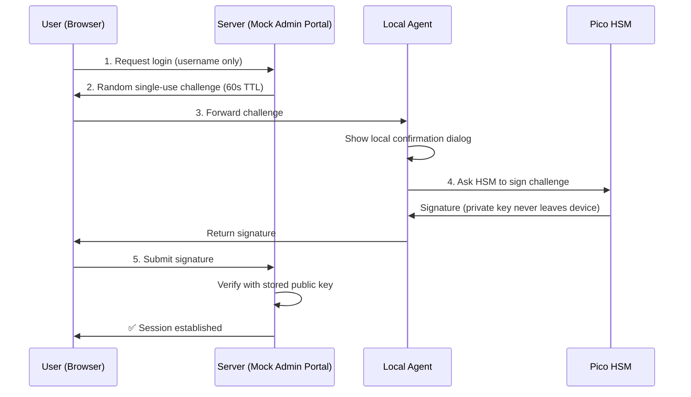

# 🔐 Digital Identity Protection & Anti-Impersonation Vault

**A Hardware-Based Credential Isolation Token using Pico HSM**

A working proof-of-concept that eliminates session-hijacking and Pass-the-Cookie attacks by moving the authentication secret out of the browser and operating system entirely — into a physical, tamper-resistant Hardware Security Module (HSM).

Instead of storing a login token in the browser, this system authenticates every login through a **Challenge-Response protocol** (conceptually the same principle behind FIDO2/WebAuthn security keys), where a private key generated and confined inside a **Pico HSM** signs a fresh, single-use challenge — and never leaves the device, not even during use.

---

## 🚨 The Problem

Modern identity attacks rarely target the password. They target the **session** that comes right after login:

1. A user logs into an admin panel.
2. The browser stores a session cookie / bearer token.
3. Malware (an "infostealer") running on the machine reads that token from disk.
4. The attacker replays the token from their own machine and is treated as the legitimate user — **without ever knowing the password.**

This is known as **Pass-the-Cookie**, and it's one of the most common ways real-world breaches happen after an endpoint is compromised. No password policy fixes this, because the weakness isn't the password — it's that a reusable secret exists in software at all.

## ✅ The Solution

This project removes the reusable secret entirely.

| Traditional Login | This Project |
|---|---|
| Static session token stored in browser | No persistent token, ever |
| Stealing the token = stealing the session | Nothing to steal — each login is a fresh signature |
| Vulnerable to Pass-the-Cookie | Structurally immune to it |
| Trust based on possession of a file | Trust based on possession of physical hardware |

Every login is a brand-new cryptographic signature, computed **inside** a Pico HSM, on a challenge that is valid for one use and 60 seconds only.

---

## 🏗️ How It Works

Three independent components, mirroring the separation of concerns in a real FIDO2 deployment:



| Component | Role |
|---|---|
| **Relying Party** (`server/`) | A mock university admin portal (Flask). Issues challenges, verifies signatures, manages sessions. |
| **Local Agent** (`agent/`) | Runs only on the user's machine, on `localhost`. The *only* component allowed to talk to the HSM. |
| **Pico HSM** | The physical root of trust. Generates the key pair internally and never exports the private key. |

---

## ✨ Features

- 🔑 **Hardware-backed key generation** — ECDSA (secp256r1) key pair generated *inside* the Pico HSM, non-extractable by design.
- 🔄 **Single-use, time-boxed challenges** — every login uses a fresh, random, 60-second nonce; replay attacks are structurally impossible.
- 🛡️ **Origin validation** — the local agent only signs requests coming from the registered site.
- 👁️ **Mandatory local confirmation** — a native dialog (outside browser control) must be approved before any signature is produced, blocking silent abuse by malware.
- 🚫 **Zero persistent client-side secret** — nothing reusable is ever stored in cookies, `localStorage`, or on disk.

---

## 🧰 Tech Stack

| Layer | Technology |
|---|---|
| Hardware root of trust | [Pico HSM](https://github.com/polhenarejos/pico-hsm) (open-source, USB smart-card HSM) |
| Card communication | [OpenSC](https://github.com/OpenSC/OpenSC) + PKCS#11 |
| HSM scripting | [python-pkcs11](https://github.com/danni/python-pkcs11) |
| Server & Local Agent | Python 3 + Flask |
| Signature algorithm | ECDSA over secp256r1 (P-256) |
| Local confirmation UI | Tkinter |

---

## 📋 Prerequisites

- Windows (tested) with a free USB port
- A physical **Pico HSM**, already initialized with a PIN
- [OpenSC](https://github.com/OpenSC/OpenSC/releases) installed (provides `opensc-pkcs11.dll`)
- Python 3.9+

---

## 🚀 Installation

```bash
git clone https://github.com/<your-username>/university-hsm-auth.git
cd university-hsm-auth
python -m venv venv
venv\Scripts\activate        # Windows
pip install -r requirements.txt
```

Verify the HSM is detected:

```bash
pkcs11-tool --module "C:\Program Files\OpenSC Project\OpenSC\pkcs11\opensc-pkcs11.dll" -L
```

Confirm the `token label` shown matches `TOKEN_LABEL` in `agent/config.py`, and update the path in that file if OpenSC is installed elsewhere.

---

## ▶️ Usage

### 1. Enroll a key (one-time, per identity)

```bash
cd agent
python enroll.py
```

Generates an ECDSA key pair **inside** the HSM and prints the public key (also saved to `agent/public_key.txt`).

### 2. Start the server

```bash
cd server
python app.py
# → running on http://127.0.0.1:5000
```

### 3. Register the public key (one-time, per user)

```bash
curl -X POST http://127.0.0.1:5000/register ^
  -H "Content-Type: application/json" ^
  -d "{\"username\": \"admin\", \"public_key\": \"<paste public key here>\"}"
```

### 4. Start the local agent

```bash
cd agent
python agent.py
```

### 5. Log in

Open `http://127.0.0.1:5000`, enter `admin`, click **Login via HSM**, and approve the local confirmation prompt.

> On every future run, you only need steps **2** and **4** — enrollment and registration happen once.

---

## 🔬 Security Model & Testing

This project was validated against the exact threat model it targets — a host with full browser/filesystem read access to an attacker (simulating an infostealer):

| Test | Result |
|---|---|
| Inspect cookies / localStorage after login | No reusable secret found |
| Access dashboard without a fresh challenge | Rejected by server |
| Kill the local agent, then attempt login | Fails completely — HSM required |
| Replay a previously valid signature | Rejected (challenge expired / already used) |

**Conclusion:** even under full OS/browser compromise, there is no practical path to impersonating the user without physically possessing the enrolled Pico HSM.

---

## 📁 Project Structure

```
university-hsm-auth/
├── agent/
│   ├── agent.py        # Local signing service (talks to the HSM)
│   ├── enroll.py        # One-time key generation script
│   └── config.py         # Shared configuration (module path, token label, ports)
├── server/
│   ├── app.py             # Flask relying party (mock admin portal)
│   ├── keys.json           # Registered public keys (username → key)
│   └── templates/
│       ├── login.html       # Challenge-response login UI
│       └── dashboard.html    # Protected page
└── requirements.txt
```

---

## 🛠️ Troubleshooting

<details>
<summary><code>NoSuchToken</code> error when running <code>enroll.py</code></summary>

Run `pkcs11-tool -L` and make sure `TOKEN_LABEL` in `agent/config.py` **exactly** matches the token label shown (including capitalization and hyphens).
</details>

<details>
<summary>Mechanism not supported error</summary>

Firmware versions can differ slightly in supported mechanisms. Check what your device actually supports:

```bash
pkcs11-tool --module "...\opensc-pkcs11.dll" -M
```

Adjust `Mechanism.EC_KEY_PAIR_GEN` / `Mechanism.ECDSA_SHA256` in the code accordingly.
</details>

<details>
<summary>Browser can't reach the local agent</summary>

Confirm `agent.py` is still running in its own terminal, and that `AGENT_URL` in `login.html` matches the host/port in `config.py`.
</details>

---

## 🗺️ Roadmap

- [ ] Replace HTTP with TLS across all connections
- [ ] Move public-key storage from flat JSON to a real database with audit logging
- [ ] Support multiple enrolled credentials per user (primary + backup) with revocation
- [ ] Migrate to native browser WebAuthn APIs
- [ ] Reinforce confirmation with a physical button/biometric where the hardware supports it

---

## 📚 References & Standards

- [Pico HSM](https://github.com/polhenarejos/pico-hsm) — open-source hardware security module
- [OpenSC](https://github.com/OpenSC/OpenSC) — smart card tools and PKCS#11 driver
- [W3C WebAuthn Level 2](https://www.w3.org/TR/webauthn-2/)
- [NIST SP 800-207 — Zero Trust Architecture](https://csrc.nist.gov/publications/detail/sp/800-207/final)
- [MITRE ATT&CK T1539 — Steal Web Session Cookie](https://attack.mitre.org/techniques/T1539/)

---


